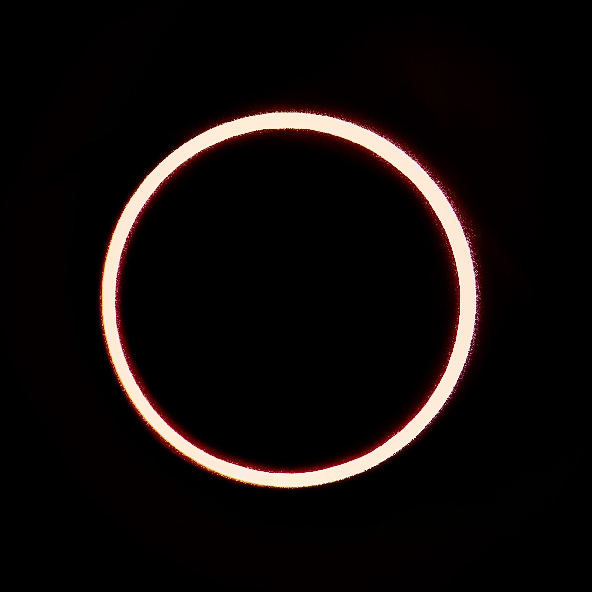
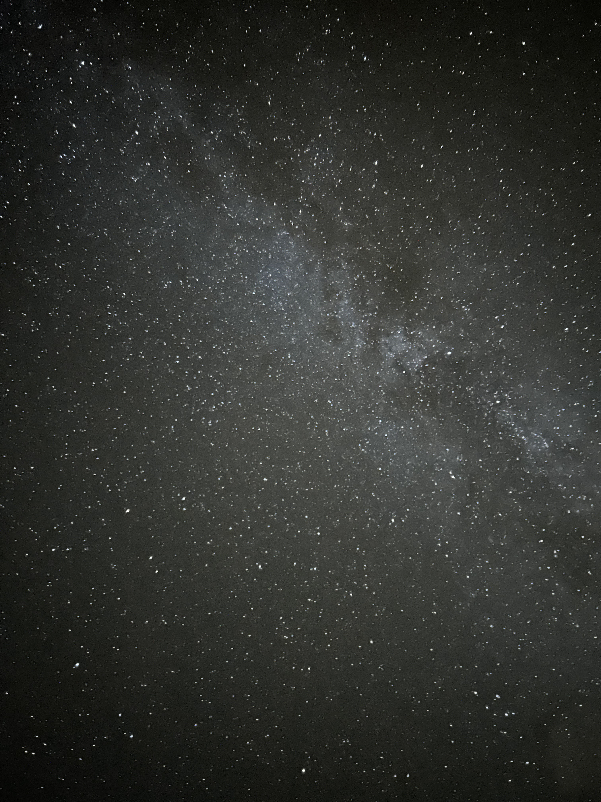

<!--  -->

That picture is of the sun covered by the moon during an *annular* solar eclipse. It was taken by attaching a solar filter to the front of our telescope and then mounting our phone camera to the telescope.

