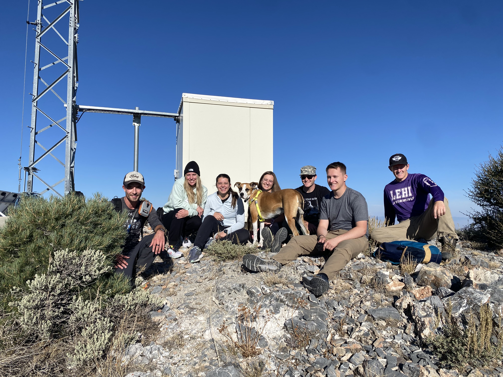
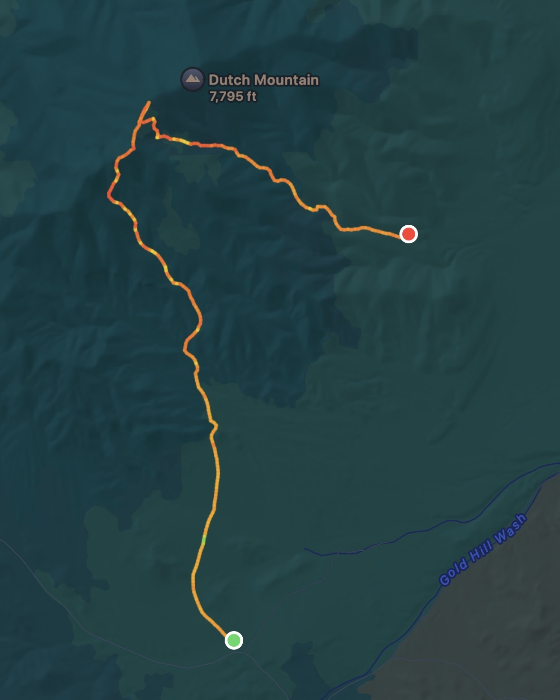
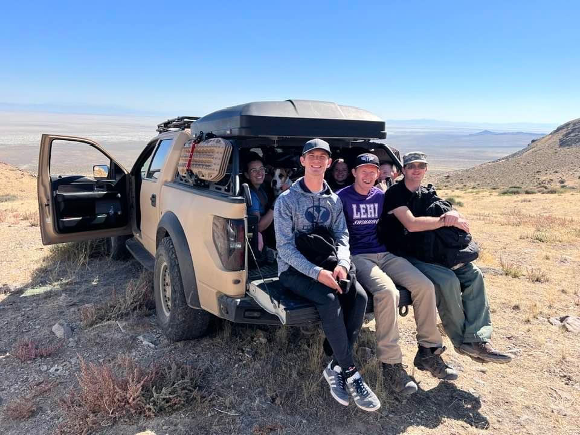
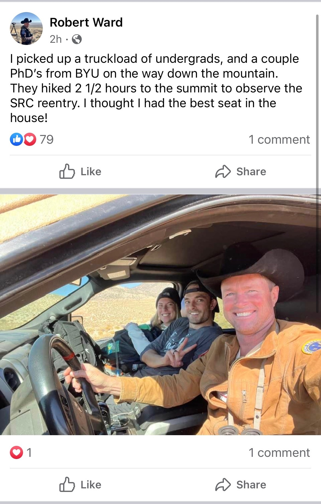

# Chasing Satellite OSIRIS-REx

**September 8th, 2016**. NASA's OSIRIS-REx mission launched from Florida. By **October 20, 2020** it had reached asteroid Bennu, collected a soil sample from it's surface, and launched the capsule holding the sample back to Earth. On **September 24, 2023**, it touched down in Utah near the Salt Flats.

We were there to meet it. We left Lehi, Utah around 3AM. To avoid potential road closures, we traveled into Nevada and then back into Utah, until we reached the base of Dutch mountain. We hiked 4 miles up the mountain to reach the summit, where we would had a clear view of the valley where the capsule was expected to land.

While the capsule overshot it's target landing zone by a few miles, we still got to hear its sonic boom (and we caught the sound on video).
<video src="/assets/blog/satellite/boom.mp4" controls></video>

On the way down we ran into Robert Ward and other officals there to observe the capsule landing. They were shocked that we were there *unofficially*. Fortunately, they offered us a ride back to our car in the back of their truck.

He actually later posted about us on Facebook!

This was the start of our group's many adventures together, but to be honest, it's still my favorite.
