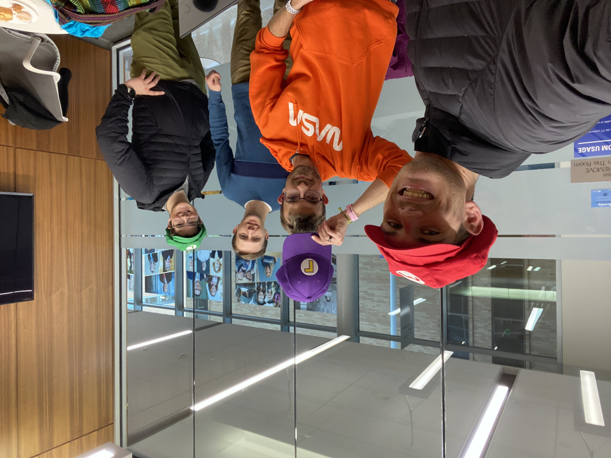
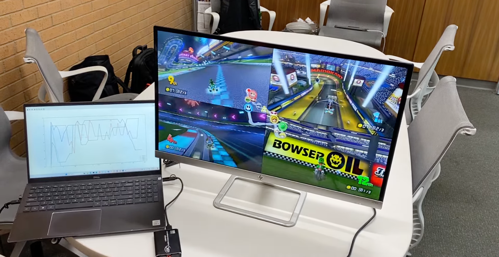
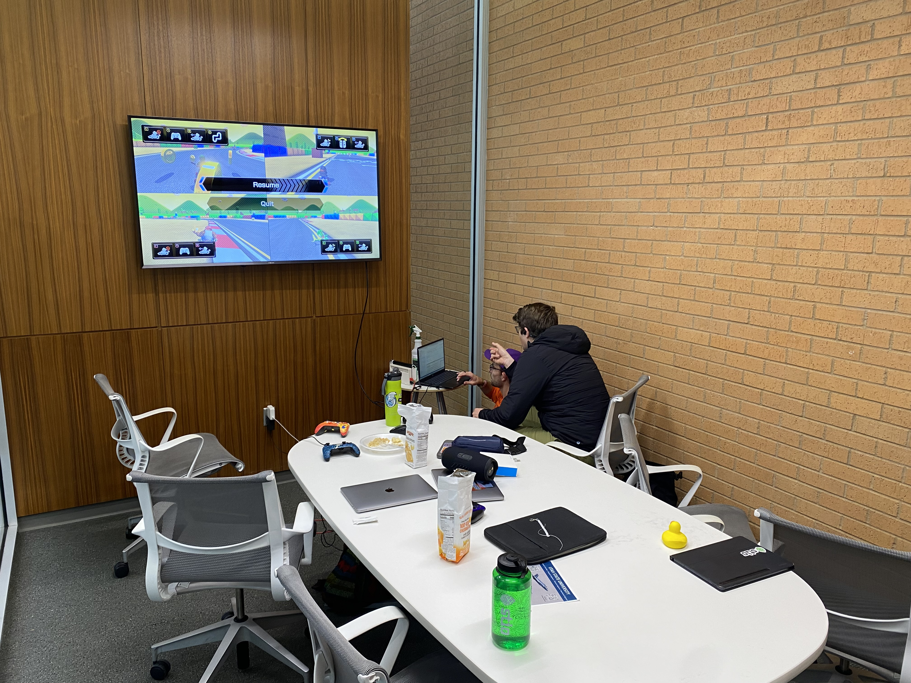

# Hack USU

As an undergrad, some friends and I participated in the annual Hack USU competition.

We built a program that used machine learning to injest the screen coming from Mariokart 8 Deluxe and plot each player's position on a graph.

It took a lot of training (cough cough... playing Mariokart), but it ended up working surprisingly well and was a big hit at the project showcase.

Here's a video of it in action
<video src="/assets/blog/hackusu/explaination.mp4" controls></video>
