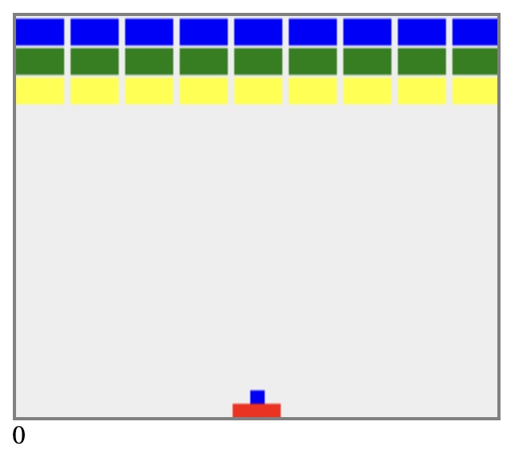

## Brick Breaker

A simple brick-breaker game I built in eighth grade using basic `Javascript` and an `HTML canvas`. While inspired by a similar game on my dad's Blackberry, the design, implementation, and code were all original to me. Play it here.
