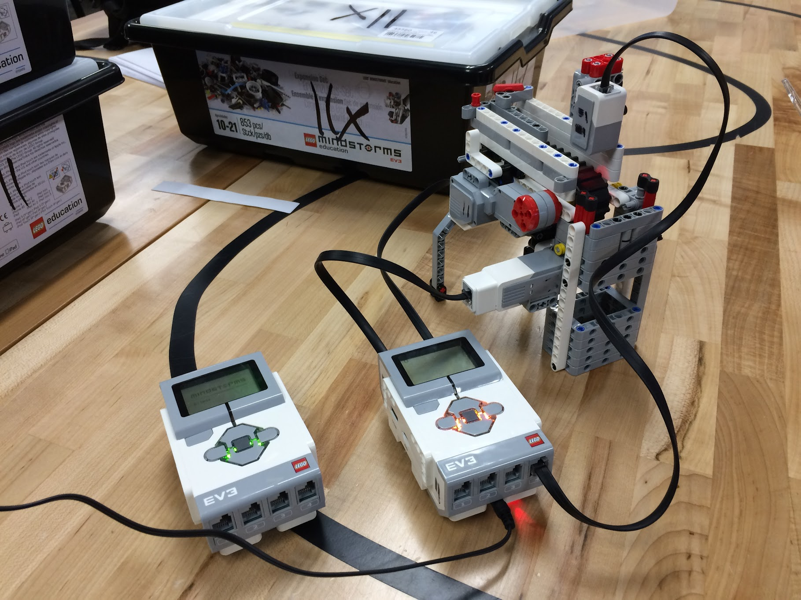

## Brown Robotics

After placing fourth in a national robotics competition, I marketed a week long summer robotics class for youth. I developed a curriculum and taught 10 teenagers the basics of programming, engineering, and robotics. After the first week of classes, both the youth and their parents requested a second session, which I then provided.
