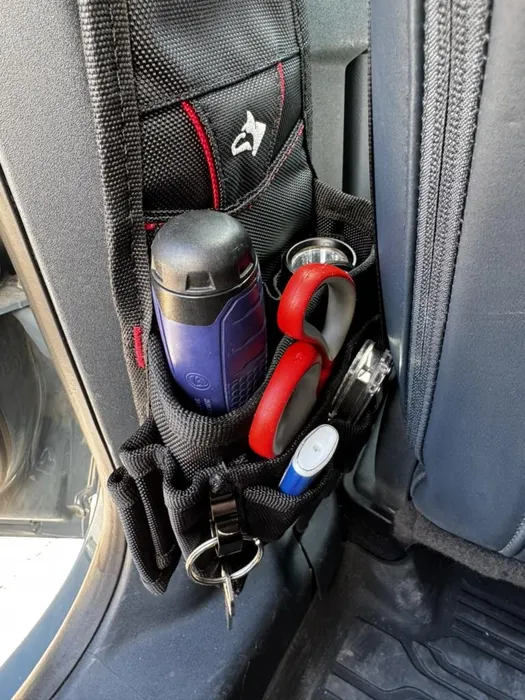
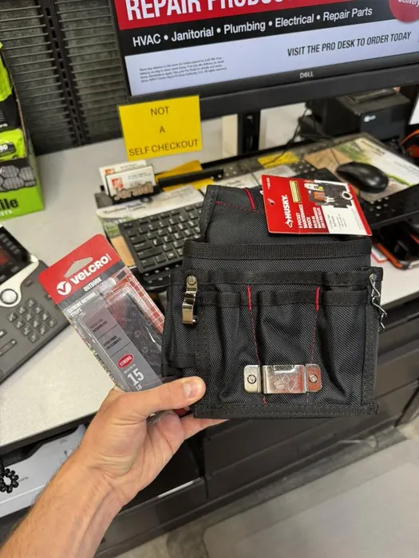
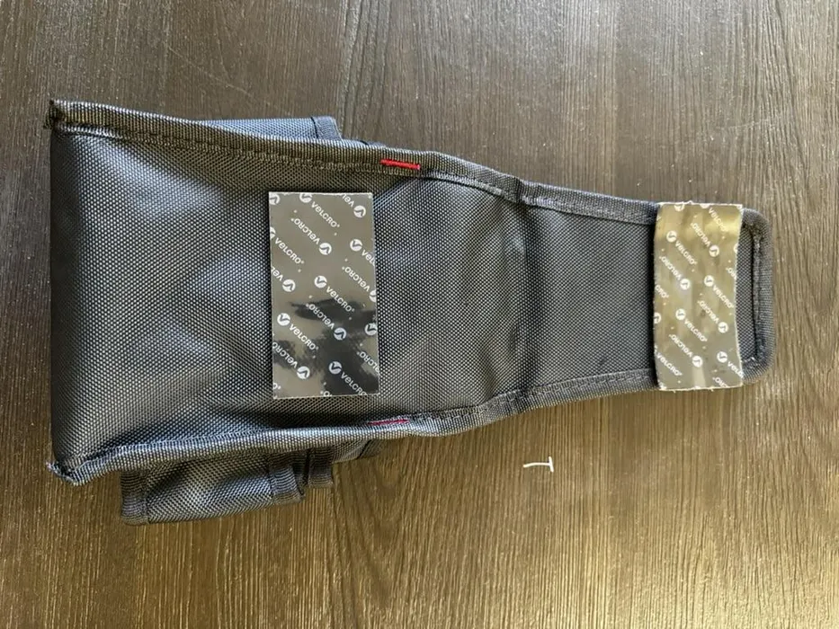
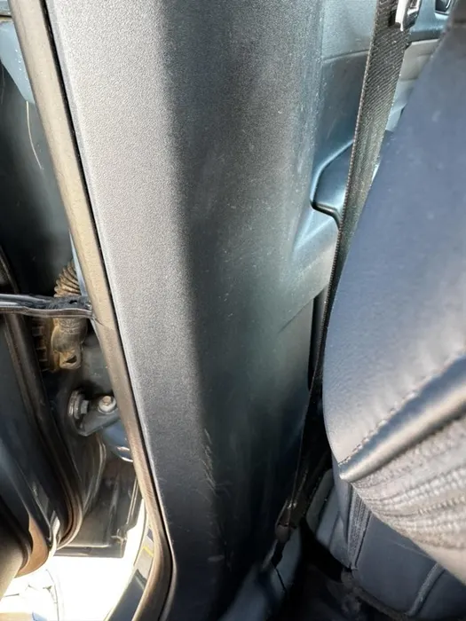
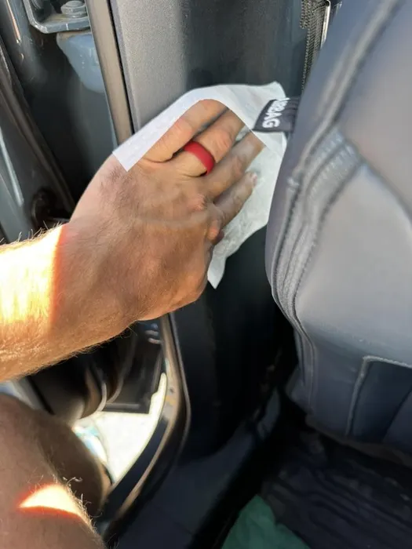

## Car Toolpouch

This toolbag attaches to the side of the inside of the car and has room for many frequently used tools. It doesn't require damaging the car at all. I personally own a `Ford Maverick` (2022), but this should work for all vehicles.

### Supplies

- Outdoor `Velcro` Strips
- `Husky` 9 Pocket Maintenance Pouch (although other `Husky` pouches with `Velcro` would likely work)

### Step 1: Attach Velcro Strips to Toolbelt

The `Husky` Toolbag is designed to wrap around a belt and then attach to itself using `Velcro`. We take advantage of this to attach outdoor `Velcro` strips. Only one set of `Velcro` strips is needed, as each side will attach to a different part of the bag. **DO NOT** remove the plastic covering the adhesive yet.

### Step 2: Select an Area of the Car to Place the Toolbag

I recommend right behind the driver seat so it is out of the way of normal movement, but still accessible if necessary. Before removing the plastic covering the adhesive, test fit where it will be placed. Keep the following in mind to ensure ideal placement:

- Doesn't rub against the chairs.
- Won't interfere with moving parts, such as chair adjustments.
- Won't interfere with seated people.
- Won't interfere with seatbelts.

It's helpful to have someone else hold it while you check its placement.

### Step 3: Clean the Service

To ensure a good grip, clean the surface with a wet-wipe prior to placing the toolpouch.

### Step 4: Place the Toolbag on the Wall

Remove the plastic covering the adhesive and place. Push firmly on the parts of the toolbag that have the `Velcro` to ensure a strong adhesion. Let it sit for a while before filling with items to ensure a tight hold.

