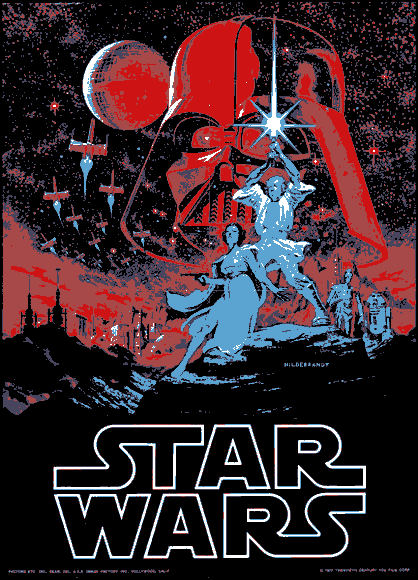

## KMeans Image Filter

I developed a simple web application which uses `KMeans clustering` to apply an interesting filter to images. The filter groups similar colors and reduces the number of different color values in the image from hundreds or thousands to 5-10 while maintaining the overall detail in the image. This is the filter I used to create the Star Wars image above. (This project is still in development.)
