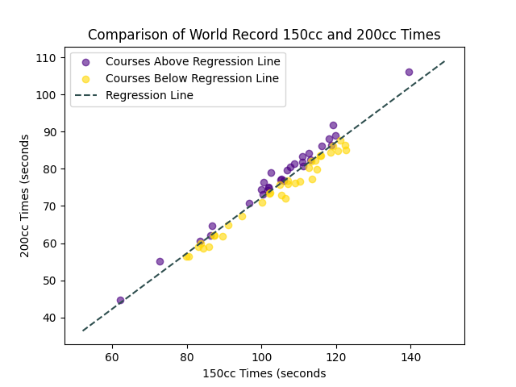

## Mario Kart Data Science

I love to play Mario Kart 8 Deluxe and have performed data science on courses and kart/character choices using world record times as a metric. This was accomplished using `web-scrapping`, `KMeans Clustering`, and `linear regression`.
