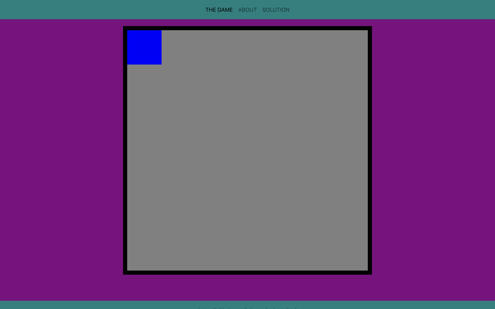

## Pure CSS Maze Game

Unlike other online games which rely on a scripting language to accept user input, update the game display, and alert the user when they win (or lose), THE GAME exclusively employs `HTML` and `CSS` to implement its functionality.
