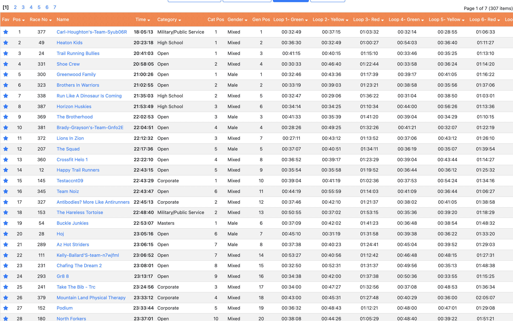

## Ragnar Rankings

I competed in a relay race called the Ragnar. Although the team rankings were released and included individual times, I couldn't easily compare my personal times against other individual racers'. I developed a `Python` program which reads the contents of Ragnar's results website and sorts the racers individually, revealing my actual placement in the race.
