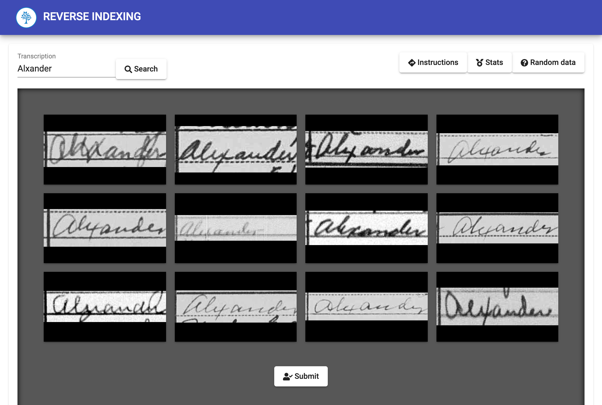

## Reverse Indexing

As a research lead in the Family History Technology Lab, I made the Reverse Indexing application 12 times more efficient in both storage usage and speed. Then realizing the output from Reverse Indexing was often erroneous, I built a pipeline from the existing application to a new `iOS` and `Android` mobile app used to clean up the annotation errors. These features support over ten thousand users as they electronically archive millions of records every year.
